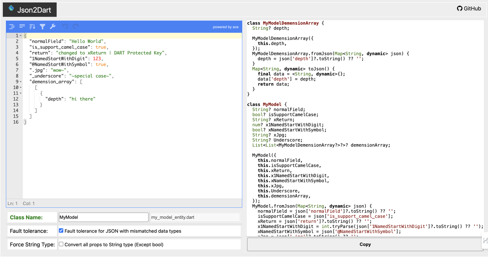

# jsonToDartModel

online tool for convert json to dart code

click [https://aditgpt.github.io/json_to_dart2023/](https://aditgpt.github.io/json_to_dart2023/)



## Feature
- online use, without plugin
- support null safe
- support multidimensional list
- support super complex json
- support convert all props to String type
- support Fault tolerance for JSON with mismatched data types
- support default value when json == null
- empty props warning
- single file
- replace all dart keyword protected
- instant convert
- robust

## FYI
- when select `Force String Type` , the `bool` type will not convert

## Usage
1. input json string in left textinput
2. input root class name in left bottom textinput
3. copy code by button or mouse

## Explore Complex Json Sample
click here for more case: [sample](https://github.com/aditgpt/json_to_dart2023/tree/gh-pages/sample)
```json
{
    "normalField": "Hello World",
    "null_field": null,
    "is_support_camel_case": true,
    "get": "changed to xGet | DART Protected Key",
    "return": "changed to xReturn | DART Protected Key",
    "1NamedStartWithDigit": 123,
    "@NamedStartWithSymbol": true,
    ".jpg":"wow~",
    "_underscore": "~special case~",
    "emptyObject": {},
    "nesObject": {
        "depth1": {
            "depth2": {
                "depth3":{
                    "message": "hi"
                }
            }
        }
    },
    "emptyArray": [],
    "priArray": [1,2,3],
    "nesObjArray":[
        {
            "user": {
                "name": "adit",
                "detail":{
                    "address": "Jakarta",
                    "age": 17.3
                },
                "work": [
                    {
                        "location": "jakarta",
                        "wife": 3
                    }    
                ]
            }
        }    
    ],
    "demension_array": [[{ "depth": "hi there" }]]
}
```


