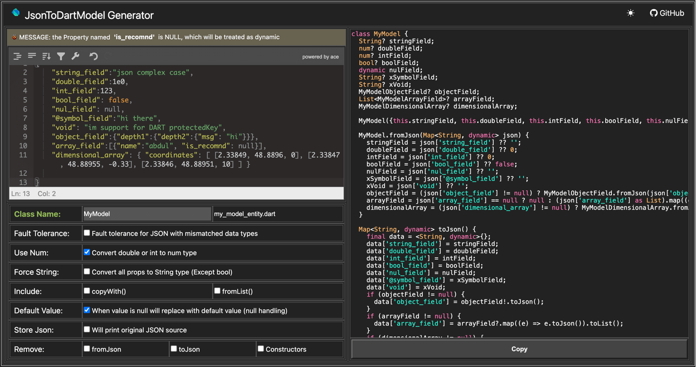

# jsonToDartModel

online tool for convert json to dart code

click [https://aditgpt.github.io/json_to_dart2023/](https://aditgpt.github.io/json_to_dart2023/)


## Feature
- online use, without plugin
- support null safe
- support multidimensional list
- support super complex json
- support convert all props to String type
- support Fault tolerance for JSON with mismatched data types
- support default value when json == null
- empty props warning
- single file
- replace all dart keyword protected
- instant convert

## FYI
- when select `Force String Type` , the `bool` type will not convert

## Usage
1. input json string in left textinput
2. input root class name in left bottom textinput
3. copy code by button or mouse

## Explore Complex Json Sample
click here for more case: [sample](https://github.com/aditgpt/json_to_dart2023/tree/gh-pages/sample)
```json
{
    "string_field":"json complex case",
    "double_field":1e0,
    "int_field":123,
    "bool_field": false,
    "nul_field": null,
    "@symbol_field":"hi there",
    "void": "im support for DART protectedKey",
    "object_field":{"depth1":{"depth2":{"msg": "hi"}}},
    "array_field":[{"name":"abdul", "is_recomnd": null}],
    "dimensional_array": { "coordinates": [ [2.33849, 48.8896, 0], [2.33847, 48.88955, -0.33], [2.33846, 48.88951, 10] ] }
    
}
```


